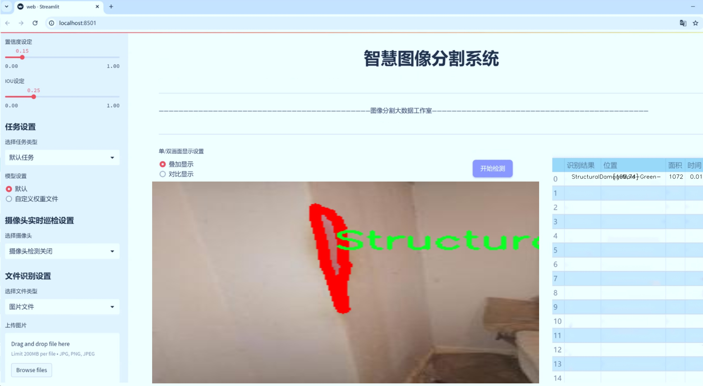
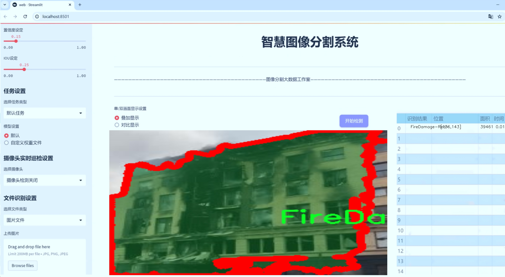
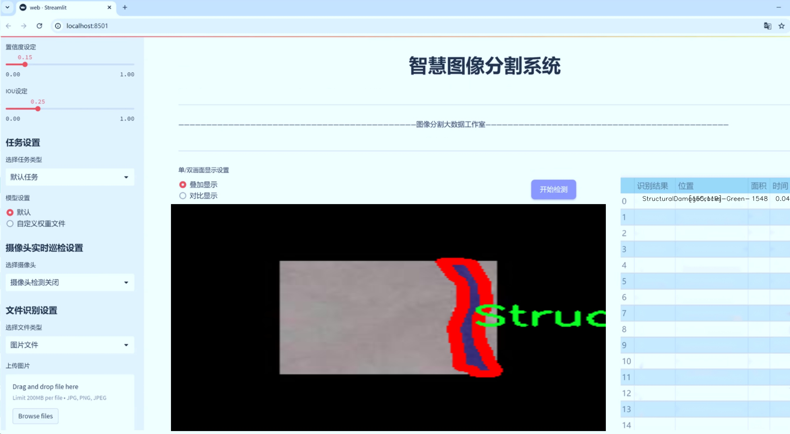
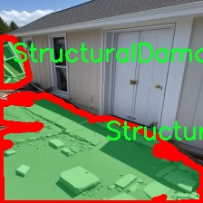
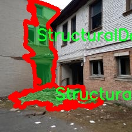
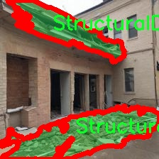
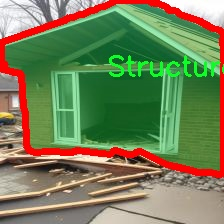

# 房屋损坏图像分割系统： yolov8-seg-fasternet-bifpn

### 1.研究背景与意义

[参考博客](https://gitee.com/YOLOv8_YOLOv11_Segmentation_Studio/projects)

[博客来源](https://kdocs.cn/l/cszuIiCKVNis)

研究背景与意义

随着城市化进程的加快和自然灾害频发，房屋损坏问题日益凸显，给人们的生活和财产安全带来了严重威胁。房屋损坏不仅影响居民的居住条件，还可能导致经济损失和社会不稳定。因此，及时、准确地识别和评估房屋损坏情况，对于灾后恢复和重建工作至关重要。传统的房屋损坏评估方法多依赖人工检查，不仅效率低下，而且容易受到主观因素的影响，导致评估结果的不准确性。近年来，计算机视觉技术的快速发展为房屋损坏的自动化评估提供了新的解决方案，尤其是基于深度学习的图像分割技术，能够在复杂环境中实现高效、精准的目标检测与分割。

YOLO（You Only Look Once）系列模型因其高效的实时检测能力而受到广泛关注。YOLOv8作为该系列的最新版本，结合了多种先进的深度学习技术，具备更强的特征提取能力和更快的推理速度。然而，针对房屋损坏图像的分割任务，YOLOv8仍存在一定的局限性，尤其是在处理复杂背景和多类别损坏的情况下。因此，改进YOLOv8以适应房屋损坏图像分割的需求，具有重要的理论价值和实际意义。

本研究基于“House Damage 2”数据集，旨在构建一个改进的YOLOv8房屋损坏图像分割系统。该数据集包含3000张图像，涵盖27个类别的房屋损坏情况，包括火灾损坏、自然灾害损坏、结构性损坏等多种类型。这些类别的细分不仅反映了房屋损坏的多样性，也为模型的训练提供了丰富的样本。通过对这些数据的深入分析和处理，可以有效提升模型在实际应用中的鲁棒性和准确性。

本研究的意义在于，首先，通过改进YOLOv8模型，能够提高房屋损坏图像的分割精度，进而为灾后评估和重建提供科学依据。其次，基于深度学习的自动化评估系统将显著提高评估效率，降低人工成本，帮助相关部门快速响应灾后救援需求。此外，本研究还将为后续的研究提供参考，推动房屋损坏评估领域的技术进步和应用拓展。

综上所述，基于改进YOLOv8的房屋损坏图像分割系统的研究，不仅具有重要的学术价值，也为实际应用提供了切实可行的解决方案。通过这一研究，期望能够为房屋损坏的自动化评估开辟新的思路，为提升城市抗灾能力和居民生活质量贡献力量。

### 2.图片演示







注意：本项目提供完整的训练源码数据集和训练教程,由于此博客编辑较早,暂不提供权重文件（best.pt）,需要按照6.训练教程进行训练后实现上图效果。

### 3.视频演示

[3.1 视频演示](https://www.bilibili.com/video/BV1kMz8Y4EQ8/)

### 4.数据集信息

##### 4.1 数据集类别数＆类别名

nc: 22
names: ['FireDamage-Amber-', 'FireDamage-Green-', 'FireDamage-Red-', 'NaturalDamageEarthquake-Amber-', 'NaturalDamageEarthquake-Green-', 'NaturalDamageEarthquake-Red-', 'NaturalDamageTornados-Amber-', 'NaturalDamageTornados-Green-', 'NaturalDamageTornados-Red-', 'NoDamage-Buildings-', 'StructuralDamageCollapses-Amber-', 'StructuralDamageCollapses-Green-', 'StructuralDamageCollapses-Red-', 'StructuralDamageCracks-Amber-', 'StructuralDamageCracks-Green-', 'StructuralDamageCracks-Red-', 'StructuralDamageMold-Amber-', 'StructuralDamageMold-Green-', 'StructuralDamageMold-Red-', 'WaterDamage-Amber-', 'WaterDamage-Green-', 'WaterDamage-Red-']


##### 4.2 数据集信息简介

数据集信息展示

在本研究中，我们使用了名为“House Damage 2”的数据集，以训练和改进YOLOv8-seg模型，旨在实现高效的房屋损坏图像分割系统。该数据集专注于房屋在不同情况下所受到的损害，提供了丰富的标注信息，涵盖了22个类别，能够有效支持模型的训练和评估。

“House Damage 2”数据集的类别设计充分考虑了房屋损坏的多样性，涵盖了火灾、自然灾害、结构性损坏和水损害等多种情况。具体而言，数据集中包括三种火灾损害类型，分别为“FireDamage-Amber-”、“FireDamage-Green-”和“FireDamage-Red-”，这些类别的设定不仅反映了火灾对建筑物的不同影响程度，也为模型提供了细致的分类依据。火灾损害的多样性强调了不同燃烧条件下对建筑材料和结构的影响，为后续的损害评估提供了重要参考。

此外，数据集中还包含了自然灾害引起的损害，具体包括地震和龙卷风造成的损害。类别如“NaturalDamageEarthquake-Amber-”、“NaturalDamageEarthquake-Green-”、“NaturalDamageEarthquake-Red-”以及“NaturalDamageTornados-Amber-”、“NaturalDamageTornados-Green-”、“NaturalDamageTornados-Red-”分别对应不同程度的损害。这些类别的设置不仅反映了自然灾害的复杂性，也为模型在实际应用中应对不同类型的损害提供了必要的训练数据。

在结构性损坏方面，数据集同样提供了多种类别，包括“StructuralDamageCollapses-Amber-”、“StructuralDamageCollapses-Green-”、“StructuralDamageCollapses-Red-”、“StructuralDamageCracks-Amber-”、“StructuralDamageCracks-Green-”、“StructuralDamageCracks-Red-”以及“StructuralDamageMold-Amber-”、“StructuralDamageMold-Green-”、“StructuralDamageMold-Red-”。这些类别涵盖了从建筑物倒塌到裂缝和霉变等多种结构性问题，确保模型能够在面对不同的结构损害时，做出准确的判断和分割。

最后，数据集中还包括了水损害的相关类别，如“WaterDamage-Amber-”、“WaterDamage-Green-”和“WaterDamage-Red-”，这些类别的设定使得模型能够识别和分割由于水浸、渗漏等原因造成的损害情况。水损害的分类不仅丰富了数据集的内容，也为模型在应对水灾后的房屋损坏评估提供了重要的数据支持。

总的来说，“House Damage 2”数据集以其多样化的类别和详尽的标注信息，为YOLOv8-seg模型的训练提供了坚实的基础。通过对不同类型房屋损坏的细致分类，该数据集不仅增强了模型的学习能力，也提升了其在实际应用中的有效性和准确性。这种精细化的分类体系为后续的研究和应用提供了广阔的前景，尤其是在灾后评估和恢复过程中，能够为决策者提供更为准确的信息支持。










### 5.项目依赖环境部署教程（零基础手把手教学）

[5.1 环境部署教程链接（零基础手把手教学）](https://www.bilibili.com/video/BV1jG4Ve4E9t/?vd_source=bc9aec86d164b67a7004b996143742dc)


[5.2 安装Python虚拟环境创建和依赖库安装视频教程链接（零基础手把手教学）](https://www.bilibili.com/video/BV1nA4VeYEze/?vd_source=bc9aec86d164b67a7004b996143742dc)

### 6.手把手YOLOV8-seg训练视频教程（零基础手把手教学）

[6.1 手把手YOLOV8-seg训练视频教程（零基础小白有手就能学会）](https://www.bilibili.com/video/BV1cA4VeYETe/?vd_source=bc9aec86d164b67a7004b996143742dc)


按照上面的训练视频教程链接加载项目提供的数据集，运行train.py即可开始训练



     Epoch   gpu_mem       box       obj       cls    labels  img_size
     1/200     0G   0.01576   0.01955  0.007536        22      1280: 100%|██████████| 849/849 [14:42<00:00,  1.04s/it]
               Class     Images     Labels          P          R     mAP@.5 mAP@.5:.95: 100%|██████████| 213/213 [01:14<00:00,  2.87it/s]
                 all       3395      17314      0.994      0.957      0.0957      0.0843

     Epoch   gpu_mem       box       obj       cls    labels  img_size
     2/200     0G   0.01578   0.01923  0.007006        22      1280: 100%|██████████| 849/849 [14:44<00:00,  1.04s/it]
               Class     Images     Labels          P          R     mAP@.5 mAP@.5:.95: 100%|██████████| 213/213 [01:12<00:00,  2.95it/s]
                 all       3395      17314      0.996      0.956      0.0957      0.0845

     Epoch   gpu_mem       box       obj       cls    labels  img_size
     3/200     0G   0.01561    0.0191  0.006895        27      1280: 100%|██████████| 849/849 [10:56<00:00,  1.29it/s]
               Class     Images     Labels          P          R     mAP@.5 mAP@.5:.95: 100%|███████   | 187/213 [00:52<00:00,  4.04it/s]
                 all       3395      17314      0.996      0.957      0.0957      0.0845


### 7.50+种全套YOLOV8-seg创新点加载调参实验视频教程（一键加载写好的改进模型的配置文件）

[7.1 50+种全套YOLOV8-seg创新点加载调参实验视频教程（一键加载写好的改进模型的配置文件）](https://www.bilibili.com/video/BV1Hw4VePEXv/?vd_source=bc9aec86d164b67a7004b996143742dc)

### YOLOV8-seg算法简介

原始YOLOv8-seg算法原理

YOLOv8-seg算法是YOLO系列中的最新进展，基于YOLOv8的架构进行了一系列针对分割任务的优化与改进。该算法不仅继承了YOLOv8在目标检测中的高效性和准确性，还在此基础上增强了对图像分割的处理能力，使其能够在复杂场景中进行更为精细的目标识别与分割。YOLOv8-seg的设计理念是将目标检测与实例分割相结合，利用深度学习的强大特性来提升图像理解的深度和广度。

在YOLOv8-seg中，输入端的设计依然保持了YOLOv8的优良传统，采用了马赛克数据增强、自适应锚框计算和自适应灰度填充等技术。这些技术的引入旨在提高模型的鲁棒性和泛化能力，确保其在多样化的应用场景中表现出色。马赛克数据增强通过将多张图像拼接成一张大图，从而增加了训练样本的多样性，帮助模型更好地学习到不同目标的特征。

YOLOv8-seg的骨干网络部分，主要采用了C2f模块，这一模块在YOLOv7的ELAN结构基础上进行了改进，进一步增强了梯度流的丰富性。C2f模块通过引入更多的跳层连接，使得特征的传递更加高效，进而提升了模型的特征表示能力。与传统的卷积层相比，C2f模块能够更好地捕捉到不同尺度和不同层次的特征信息，这对于分割任务尤为重要，因为分割任务通常需要对图像中的细节进行精准的识别和处理。

在颈部网络中，YOLOv8-seg采用了路径聚合网络（PAN）结构，这一结构能够有效地融合来自不同尺度的特征。PAN通过自底向上的路径聚合特征，使得网络能够在处理不同大小目标时，保持较高的检测精度和分割效果。这种特征融合策略对于复杂场景中的目标分割尤为关键，因为目标的尺度和形状可能会有很大的变化。

头部网络的设计是YOLOv8-seg的一大亮点。与传统的耦合头不同，YOLOv8-seg采用了解耦头的结构，将分类和定位任务分开处理。这种设计使得模型在进行目标分类时，可以更专注于特征图中的类别信息，而在进行边界框回归时，则可以更精准地调整边界框的位置。通过这种方式，YOLOv8-seg能够在分类和定位的任务上实现更快的收敛速度和更高的预测精度。

此外，YOLOv8-seg还引入了无锚框检测机制，直接预测目标的中心位置。这一创新的设计使得模型在处理目标时，不再依赖于传统的锚框，而是通过任务对齐学习（Task Alignment Learning）来区分正负样本。这种方法通过引入分类分数和IOU的高次幂乘积作为衡量标准，确保了分类和定位任务的对齐程度，从而在损失函数中引入了更为精准的评价指标。

在分割任务的实现上，YOLOv8-seg通过结合实例分割的需求，进一步增强了模型的输出能力。通过对特征图的精细处理，YOLOv8-seg能够生成高质量的分割掩码，这对于后续的图像分析和理解具有重要意义。无论是在智能监控、自动驾驶还是医疗影像分析等领域，YOLOv8-seg都展现出了其强大的应用潜力。

综上所述，YOLOv8-seg算法通过对YOLOv8的多项技术改进，不仅提升了目标检测的精度和速度，还在实例分割任务中展现了卓越的性能。其创新的网络结构、特征融合策略以及无锚框检测机制，使得YOLOv8-seg在复杂场景下的目标识别与分割能力得到了显著增强。这一算法的提出，不仅为计算机视觉领域带来了新的研究方向，也为实际应用提供了更为高效的解决方案。随着YOLOv8-seg的不断发展与完善，未来在更多领域的应用将会更加广泛，推动智能视觉技术的进一步进步。


### 9.系统功能展示（检测对象为举例，实际内容以本项目数据集为准）

图9.1.系统支持检测结果表格显示

  图9.2.系统支持置信度和IOU阈值手动调节

  图9.3.系统支持自定义加载权重文件best.pt(需要你通过步骤5中训练获得)

  图9.4.系统支持摄像头实时识别

  图9.5.系统支持图片识别

  图9.6.系统支持视频识别

  图9.7.系统支持识别结果文件自动保存

  图9.8.系统支持Excel导出检测结果数据


### 10.50+种全套YOLOV8-seg创新点原理讲解（非科班也可以轻松写刊发刊，V11版本正在科研待更新）

#### 10.1 由于篇幅限制，每个创新点的具体原理讲解就不一一展开，具体见下列网址中的创新点对应子项目的技术原理博客网址【Blog】：


[10.1 50+种全套YOLOV8-seg创新点原理讲解链接](https://gitee.com/qunmasj/good)

#### 10.2 部分改进模块原理讲解(完整的改进原理见上图和技术博客链接)【如果此小节的图加载失败可以通过CSDN或者Github搜索该博客的标题访问原始博客，原始博客图片显示正常】
### CBAM空间注意力机制
近年来，随着深度学习研究方向的火热，注意力机制也被广泛地应用在图像识别、语音识别和自然语言处理等领域，注意力机制在深度学习任务中发挥着举足轻重的作用。注意力机制借鉴于人类的视觉系统，例如，人眼在看到一幅画面时，会倾向于关注画面中的重要信息，而忽略其他可见的信息。深度学习中的注意力机制和人类视觉的注意力机制相似，通过扫描全局数据，从大量数据中选择出需要重点关注的、对当前任务更为重要的信息，然后对这部分信息分配更多的注意力资源，从这些信息中获取更多所需要的细节信息，而抑制其他无用的信息。而在深度学习中，则具体表现为给感兴趣的区域更高的权重，经过网络的学习和调整，得到最优的权重分配，形成网络模型的注意力，使网络拥有更强的学习能力，加快网络的收敛速度。
注意力机制通常可分为软注意力机制和硬注意力机制[4-5]。软注意力机制在选择信息时，不是从输入的信息中只选择1个，而会用到所有输入信息，只是各个信息对应的权重分配不同，然后输入网络模型进行计算;硬注意力机制则是从输入的信息中随机选取一个或者选择概率最高的信息，但是这一步骤通常是不可微的，导致硬注意力机制更难训练。因此，软注意力机制应用更为广泛，按照原理可将软注意力机制划分为:通道注意力机制（channel attention)、空间注意力机制(spatial attention）和混合域注意力机制(mixed attention)。
通道注意力机制的本质建立各个特征通道之间的重要程度，对感兴趣的通道进行重点关注，弱化不感兴趣的通道的作用;空间注意力的本质则是建模了整个空间信息的重要程度，然后对空间内感兴趣的区域进行重点关注，弱化其余非感兴趣区域的作用;混合注意力同时运用了通道注意力和空间注意力，两部分先后进行或并行，形成对通道特征和空间特征同时关注的注意力模型。

卷积层注意力模块(Convolutional Block Attention Module，CBAM）是比较常用的混合注意力模块，其先后集中了通道注意力模块和空间注意力模块，网络中加入该模块能有效提高网络性能，减少网络模型的计算量，模块结构如图所示。输入特征图首先经过分支的通道注意力模块，然后和主干的原特征图融合，得到具有通道注意力的特征图，接着经过分支的空间注意力模块，在和主干的特征图融合后，得到同时具有通道特征注意力和空间特征注意力的特征图。CBAM模块不改变输入特征图的大小，因此该模块是一个“即插即用”的模块，可以插入网络的任何位置。

通道注意力模块的结构示意图如图所示，通道注意力模块分支并行地对输入的特征图进行最大池化操作和平均池化操作，然后利用多层感知机对结果进行变换，得到应用于两个通道的变换结果，最后经过sigmoid激活函数将变换结果融合，得到具有通道注意力的通道特征图。

空间注意力模块示意图如图所示，将通道注意力模块输出的特征图作为该模块的输入特征图，首先对输入特征图进行基于通道的最大池化操作和平均池化操作，将两部分得到的结果拼接起来，然后通过卷积得到降为Ⅰ通道的特征图，最后通过sigmoid激活函数生成具有空间注意力的特征图。


### 11.项目核心源码讲解（再也不用担心看不懂代码逻辑）

#### 11.1 ultralytics\models\rtdetr\val.py

以下是对给定代码的核心部分进行分析和详细注释的结果：

```python
# Ultralytics YOLO 🚀, AGPL-3.0 license

from pathlib import Path
import torch
from ultralytics.data import YOLODataset
from ultralytics.data.augment import Compose, v8_transforms
from ultralytics.models.yolo.detect import DetectionValidator
from ultralytics.utils import ops

class RTDETRDataset(YOLODataset):
    """
    RT-DETR 数据集类，继承自 YOLODataset 类，专为实时检测和跟踪任务设计。
    """

    def __init__(self, *args, data=None, **kwargs):
        """初始化 RTDETRDataset 类，调用父类构造函数。"""
        super().__init__(*args, data=data, use_segments=False, use_keypoints=False, **kwargs)

    def load_image(self, i, rect_mode=False):
        """从数据集中加载索引为 'i' 的图像，返回图像及其调整后的尺寸。"""
        return super().load_image(i=i, rect_mode=rect_mode)

    def build_transforms(self, hyp=None):
        """构建图像转换操作，仅用于评估阶段。"""
        if self.augment:
            # 根据增强参数设置马赛克和混合增强的比例
            hyp.mosaic = hyp.mosaic if self.augment and not self.rect else 0.0
            hyp.mixup = hyp.mixup if self.augment and not self.rect else 0.0
            # 使用 v8_transforms 构建转换
            transforms = v8_transforms(self, self.imgsz, hyp, stretch=True)
        else:
            transforms = Compose([])  # 无转换操作

        # 添加格式化转换
        transforms.append(
            Format(bbox_format='xywh',
                   normalize=True,
                   return_mask=self.use_segments,
                   return_keypoint=self.use_keypoints,
                   batch_idx=True,
                   mask_ratio=hyp.mask_ratio,
                   mask_overlap=hyp.overlap_mask))
        return transforms


class RTDETRValidator(DetectionValidator):
    """
    RTDETRValidator 类扩展了 DetectionValidator 类，提供专门针对 RT-DETR 模型的验证功能。
    """

    def build_dataset(self, img_path, mode='val', batch=None):
        """
        构建 RTDETR 数据集。

        Args:
            img_path (str): 包含图像的文件夹路径。
            mode (str): 模式（训练或验证），用户可以为每种模式自定义不同的增强。
            batch (int, optional): 批量大小，仅用于矩形模式。默认为 None。
        """
        return RTDETRDataset(
            img_path=img_path,
            imgsz=self.args.imgsz,
            batch_size=batch,
            augment=False,  # 不进行增强
            hyp=self.args,
            rect=False,  # 不使用矩形模式
            cache=self.args.cache or None,
            prefix=colorstr(f'{mode}: '),
            data=self.data)

    def postprocess(self, preds):
        """对预测输出应用非极大值抑制（NMS）。"""
        bs, _, nd = preds[0].shape  # 获取批量大小、通道数和检测框数量
        bboxes, scores = preds[0].split((4, nd - 4), dim=-1)  # 分离边界框和分数
        bboxes *= self.args.imgsz  # 将边界框缩放到原始图像大小
        outputs = [torch.zeros((0, 6), device=bboxes.device)] * bs  # 初始化输出

        for i, bbox in enumerate(bboxes):  # 遍历每个边界框
            bbox = ops.xywh2xyxy(bbox)  # 转换边界框格式
            score, cls = scores[i].max(-1)  # 获取最大分数和对应类别
            pred = torch.cat([bbox, score[..., None], cls[..., None]], dim=-1)  # 合并边界框、分数和类别
            pred = pred[score.argsort(descending=True)]  # 按分数排序
            outputs[i] = pred  # 保存预测结果

        return outputs

    def update_metrics(self, preds, batch):
        """更新评估指标。"""
        for si, pred in enumerate(preds):
            idx = batch['batch_idx'] == si  # 获取当前批次的索引
            cls = batch['cls'][idx]  # 获取当前批次的类别
            bbox = batch['bboxes'][idx]  # 获取当前批次的边界框
            nl, npr = cls.shape[0], pred.shape[0]  # 标签数量和预测数量
            shape = batch['ori_shape'][si]  # 原始图像形状
            correct_bboxes = torch.zeros(npr, self.niou, dtype=torch.bool, device=self.device)  # 初始化正确边界框

            self.seen += 1  # 更新已处理的样本数量

            if npr == 0:  # 如果没有预测
                if nl:
                    self.stats.append((correct_bboxes, *torch.zeros((2, 0), device=self.device), cls.squeeze(-1)))
                continue

            # 处理预测
            if self.args.single_cls:
                pred[:, 5] = 0  # 单类情况，设置类别为0
            predn = pred.clone()  # 克隆预测
            predn[..., [0, 2]] *= shape[1] / self.args.imgsz  # 将预测边界框转换为原始空间
            predn[..., [1, 3]] *= shape[0] / self.args.imgsz  # 将预测边界框转换为原始空间

            if nl:  # 如果有标签
                tbox = ops.xywh2xyxy(bbox)  # 转换目标边界框格式
                tbox[..., [0, 2]] *= shape[1]  # 转换为原始空间
                tbox[..., [1, 3]] *= shape[0]  # 转换为原始空间
                labelsn = torch.cat((cls, tbox), 1)  # 合并标签和目标边界框
                correct_bboxes = self._process_batch(predn.float(), labelsn)  # 处理批次以获取正确的边界框

            self.stats.append((correct_bboxes, pred[:, 4], pred[:, 5], cls.squeeze(-1)))  # 更新统计信息

            # 保存预测结果
            if self.args.save_json:
                self.pred_to_json(predn, batch['im_file'][si])
            if self.args.save_txt:
                file = self.save_dir / 'labels' / f'{Path(batch["im_file"][si]).stem}.txt'
                self.save_one_txt(predn, self.args.save_conf, shape, file)
```

### 代码核心部分分析
1. **RTDETRDataset 类**:
   - 继承自 `YOLODataset`，用于处理 RT-DETR 模型的数据集。
   - 主要功能包括加载图像和构建数据增强转换。

2. **RTDETRValidator 类**:
   - 继承自 `DetectionValidator`，用于对 RT-DETR 模型进行验证。
   - 包含构建数据集、后处理预测结果（应用非极大值抑制）和更新评估指标的方法。

### 主要功能
- **数据集管理**: `RTDETRDataset` 负责图像的加载和转换。
- **验证过程**: `RTDETRValidator` 负责验证模型的输出，计算指标并保存结果。

这个文件 `ultralytics/models/rtdetr/val.py` 是用于实现 RT-DETR（实时检测与跟踪）模型的验证功能。它主要包含两个类：`RTDETRDataset` 和 `RTDETRValidator`，分别用于数据集的构建和模型验证。

首先，`RTDETRDataset` 类继承自 `YOLODataset`，用于处理 RT-DETR 模型所需的数据集。该类的构造函数调用了父类的构造函数，并设置了一些特定的参数，如不使用分段和关键点。`load_image` 方法用于加载指定索引的图像，并返回图像及其调整后的尺寸。`build_transforms` 方法用于构建图像变换，包括对图像的格式化和归一化处理，适用于模型的输入。

接下来，`RTDETRValidator` 类继承自 `DetectionValidator`，专门为 RT-DETR 模型提供验证功能。它的 `build_dataset` 方法用于构建 RT-DETR 数据集，接收图像路径、模式（训练或验证）和批量大小等参数。该方法返回一个 `RTDETRDataset` 实例，设置了一些参数如不进行数据增强和不使用矩形模式。

`postprocess` 方法对模型的预测结果应用非极大值抑制（NMS），以去除冗余的边界框。它将预测的边界框和分数分开，计算出最终的输出结果，并按置信度排序。

`update_metrics` 方法用于更新验证过程中使用的评估指标。它根据预测结果和真实标签计算正确的边界框，并将相关信息存储到统计数据中。该方法还处理了一些可选的功能，如绘制混淆矩阵和保存预测结果到 JSON 或 TXT 文件。

总体而言，这个文件的主要功能是为 RT-DETR 模型提供一个高效的验证框架，包括数据集的加载、图像处理、预测结果的后处理和评估指标的更新，旨在帮助开发者评估模型的性能。

#### 11.2 ultralytics\trackers\utils\matching.py

以下是代码中最核心的部分，并附上详细的中文注释：

```python
import numpy as np
import scipy
from scipy.spatial.distance import cdist
from ultralytics.utils.metrics import bbox_ioa

try:
    import lap  # 导入线性分配库
    assert lap.__version__  # 验证包是否正确安装
except (ImportError, AssertionError, AttributeError):
    from ultralytics.utils.checks import check_requirements
    check_requirements('lapx>=0.5.2')  # 检查并安装所需的lap包
    import lap

def linear_assignment(cost_matrix, thresh, use_lap=True):
    """
    使用线性分配算法进行匹配。

    参数:
        cost_matrix (np.ndarray): 包含分配成本的矩阵。
        thresh (float): 认为分配有效的阈值。
        use_lap (bool, optional): 是否使用lap.lapjv进行计算。默认为True。

    返回:
        (tuple): 包含匹配索引、未匹配的索引（来自'a'）和未匹配的索引（来自'b'）的元组。
    """
    if cost_matrix.size == 0:
        return np.empty((0, 2), dtype=int), tuple(range(cost_matrix.shape[0])), tuple(range(cost_matrix.shape[1]))

    if use_lap:
        # 使用lap库进行线性分配
        _, x, y = lap.lapjv(cost_matrix, extend_cost=True, cost_limit=thresh)
        matches = [[ix, mx] for ix, mx in enumerate(x) if mx >= 0]  # 记录匹配的索引
        unmatched_a = np.where(x < 0)[0]  # 找到未匹配的'a'索引
        unmatched_b = np.where(y < 0)[0]  # 找到未匹配的'b'索引
    else:
        # 使用scipy库进行线性分配
        x, y = scipy.optimize.linear_sum_assignment(cost_matrix)  # 进行线性分配
        matches = np.asarray([[x[i], y[i]] for i in range(len(x)) if cost_matrix[x[i], y[i]] <= thresh])
        if len(matches) == 0:
            unmatched_a = list(np.arange(cost_matrix.shape[0]))
            unmatched_b = list(np.arange(cost_matrix.shape[1]))
        else:
            unmatched_a = list(set(np.arange(cost_matrix.shape[0])) - set(matches[:, 0]))
            unmatched_b = list(set(np.arange(cost_matrix.shape[1])) - set(matches[:, 1]))

    return matches, unmatched_a, unmatched_b  # 返回匹配结果和未匹配索引

def iou_distance(atracks, btracks):
    """
    基于交并比（IoU）计算轨迹之间的成本。

    参数:
        atracks (list[STrack] | list[np.ndarray]): 轨迹'a'或边界框的列表。
        btracks (list[STrack] | list[np.ndarray]): 轨迹'b'或边界框的列表。

    返回:
        (np.ndarray): 基于IoU计算的成本矩阵。
    """
    if (len(atracks) > 0 and isinstance(atracks[0], np.ndarray)) \
            or (len(btracks) > 0 and isinstance(btracks[0], np.ndarray)):
        atlbrs = atracks  # 直接使用传入的边界框
        btlbrs = btracks
    else:
        atlbrs = [track.tlbr for track in atracks]  # 提取轨迹'a'的边界框
        btlbrs = [track.tlbr for track in btracks]  # 提取轨迹'b'的边界框

    ious = np.zeros((len(atlbrs), len(btlbrs)), dtype=np.float32)  # 初始化IoU矩阵
    if len(atlbrs) and len(btlbrs):
        # 计算IoU
        ious = bbox_ioa(np.ascontiguousarray(atlbrs, dtype=np.float32),
                        np.ascontiguousarray(btlbrs, dtype=np.float32),
                        iou=True)
    return 1 - ious  # 返回成本矩阵（1 - IoU）

def embedding_distance(tracks, detections, metric='cosine'):
    """
    基于嵌入特征计算轨迹和检测之间的距离。

    参数:
        tracks (list[STrack]): 轨迹列表。
        detections (list[BaseTrack]): 检测列表。
        metric (str, optional): 距离计算的度量方式。默认为'cosine'。

    返回:
        (np.ndarray): 基于嵌入计算的成本矩阵。
    """
    cost_matrix = np.zeros((len(tracks), len(detections)), dtype=np.float32)  # 初始化成本矩阵
    if cost_matrix.size == 0:
        return cost_matrix
    det_features = np.asarray([track.curr_feat for track in detections], dtype=np.float32)  # 提取检测特征
    track_features = np.asarray([track.smooth_feat for track in tracks], dtype=np.float32)  # 提取轨迹特征
    cost_matrix = np.maximum(0.0, cdist(track_features, det_features, metric))  # 计算距离并确保非负
    return cost_matrix  # 返回成本矩阵

def fuse_score(cost_matrix, detections):
    """
    将成本矩阵与检测分数融合以生成单一相似度矩阵。

    参数:
        cost_matrix (np.ndarray): 包含分配成本的矩阵。
        detections (list[BaseTrack]): 带有分数的检测列表。

    返回:
        (np.ndarray): 融合后的相似度矩阵。
    """
    if cost_matrix.size == 0:
        return cost_matrix
    iou_sim = 1 - cost_matrix  # 计算IoU相似度
    det_scores = np.array([det.score for det in detections])  # 提取检测分数
    det_scores = np.expand_dims(det_scores, axis=0).repeat(cost_matrix.shape[0], axis=0)  # 扩展分数维度
    fuse_sim = iou_sim * det_scores  # 融合相似度
    return 1 - fuse_sim  # 返回融合后的成本矩阵
```

### 代码核心部分说明：
1. **线性分配（linear_assignment）**：该函数用于根据给定的成本矩阵进行匹配，返回匹配的索引和未匹配的索引。
2. **IoU距离（iou_distance）**：计算轨迹之间的交并比（IoU），并返回成本矩阵。
3. **嵌入距离（embedding_distance）**：计算轨迹和检测之间的距离，基于特征嵌入。
4. **融合分数（fuse_score）**：将成本矩阵与检测分数结合，生成相似度矩阵。

这个程序文件主要实现了目标跟踪中的匹配算法，特别是线性分配和成本矩阵的计算。文件中导入了必要的库，包括NumPy和SciPy，以及用于线性分配的lap库（如果未安装，则会尝试安装一个替代库）。接下来，我们逐步分析文件中的主要功能。

首先，`linear_assignment`函数用于执行线性分配。它接受一个成本矩阵、一个阈值和一个可选参数，指示是否使用lap库进行计算。函数首先检查成本矩阵是否为空，如果为空，则返回空的匹配结果和未匹配的索引。若使用lap库，则调用其`lapjv`函数进行匹配，并根据匹配结果提取匹配的索引和未匹配的索引。如果不使用lap库，则使用SciPy的`linear_sum_assignment`函数进行匹配，并同样提取匹配和未匹配的索引。最终，函数返回匹配的索引以及未匹配的索引。

接下来的`iou_distance`函数计算基于交并比（IoU）的成本矩阵。它接受两个参数，分别是两个轨迹或边界框的列表。函数首先检查输入数据的类型，并提取边界框的坐标。然后，利用`bbox_ioa`函数计算IoU值，并返回1减去IoU值作为成本矩阵，表示匹配的代价。

`embedding_distance`函数则计算轨迹和检测之间基于特征嵌入的距离。它接受轨迹列表、检测列表和一个可选的距离度量参数。函数初始化一个成本矩阵，并提取检测的特征。然后，计算轨迹特征与检测特征之间的距离，并返回成本矩阵。

最后，`fuse_score`函数将成本矩阵与检测得分融合，生成一个相似度矩阵。它首先检查成本矩阵是否为空，然后计算IoU相似度，并将检测得分扩展到与成本矩阵相同的形状。最后，通过将IoU相似度与检测得分相乘，得到融合后的相似度矩阵，并返回1减去融合结果作为最终的成本。

总体而言，这个文件实现了目标跟踪中重要的匹配算法，通过计算不同的成本矩阵，帮助系统在跟踪过程中进行有效的目标匹配。

#### 11.3 ultralytics\nn\extra_modules\dynamic_snake_conv.py

以下是经过简化和注释的核心代码部分，主要包括 `DySnakeConv` 和 `DSConv` 类的实现，以及 `DSC` 类的核心功能。注释详细解释了每个部分的功能和逻辑。

```python
import torch
import torch.nn as nn

class DySnakeConv(nn.Module):
    def __init__(self, inc, ouc, k=3) -> None:
        """
        DySnakeConv的构造函数
        :param inc: 输入通道数
        :param ouc: 输出通道数
        :param k: 卷积核的大小
        """
        super().__init__()
        
        # 定义三个卷积层
        self.conv_0 = Conv(inc, ouc, k)  # 标准卷积
        self.conv_x = DSConv(inc, ouc, 0, k)  # 沿x轴的动态蛇卷积
        self.conv_y = DSConv(inc, ouc, 1, k)  # 沿y轴的动态蛇卷积
    
    def forward(self, x):
        """
        前向传播函数
        :param x: 输入特征图
        :return: 拼接后的输出特征图
        """
        # 将三个卷积的输出在通道维度上拼接
        return torch.cat([self.conv_0(x), self.conv_x(x), self.conv_y(x)], dim=1)

class DSConv(nn.Module):
    def __init__(self, in_ch, out_ch, morph, kernel_size=3, if_offset=True, extend_scope=1):
        """
        动态蛇卷积的构造函数
        :param in_ch: 输入通道数
        :param out_ch: 输出通道数
        :param morph: 卷积核的形态（沿x轴或y轴）
        :param kernel_size: 卷积核的大小
        :param if_offset: 是否需要偏移
        :param extend_scope: 扩展范围
        """
        super(DSConv, self).__init__()
        # 用于学习可变形偏移的卷积层
        self.offset_conv = nn.Conv2d(in_ch, 2 * kernel_size, 3, padding=1)
        self.bn = nn.BatchNorm2d(2 * kernel_size)  # 批归一化
        self.kernel_size = kernel_size

        # 定义沿x轴和y轴的动态蛇卷积
        self.dsc_conv_x = nn.Conv2d(in_ch, out_ch, kernel_size=(kernel_size, 1), stride=(kernel_size, 1), padding=0)
        self.dsc_conv_y = nn.Conv2d(in_ch, out_ch, kernel_size=(1, kernel_size), stride=(1, kernel_size), padding=0)

        self.gn = nn.GroupNorm(out_ch // 4, out_ch)  # 组归一化
        self.act = Conv.default_act  # 默认激活函数

        self.extend_scope = extend_scope
        self.morph = morph
        self.if_offset = if_offset

    def forward(self, f):
        """
        前向传播函数
        :param f: 输入特征图
        :return: 经过动态蛇卷积后的特征图
        """
        # 计算偏移
        offset = self.offset_conv(f)
        offset = self.bn(offset)
        offset = torch.tanh(offset)  # 将偏移限制在[-1, 1]之间

        # 创建DSC对象以进行变形卷积
        dsc = DSC(f.shape, self.kernel_size, self.extend_scope, self.morph)
        deformed_feature = dsc.deform_conv(f, offset, self.if_offset)  # 进行变形卷积

        # 根据形态选择相应的卷积操作
        if self.morph == 0:
            x = self.dsc_conv_x(deformed_feature.type(f.dtype))
        else:
            x = self.dsc_conv_y(deformed_feature.type(f.dtype))

        x = self.gn(x)  # 归一化
        x = self.act(x)  # 激活
        return x

class DSC(object):
    def __init__(self, input_shape, kernel_size, extend_scope, morph):
        """
        DSC的构造函数
        :param input_shape: 输入特征图的形状
        :param kernel_size: 卷积核的大小
        :param extend_scope: 扩展范围
        :param morph: 卷积核的形态
        """
        self.num_points = kernel_size
        self.width = input_shape[2]
        self.height = input_shape[3]
        self.morph = morph
        self.extend_scope = extend_scope

        # 定义特征图的形状
        self.num_batch = input_shape[0]
        self.num_channels = input_shape[1]

    def deform_conv(self, input, offset, if_offset):
        """
        进行变形卷积
        :param input: 输入特征图
        :param offset: 偏移量
        :param if_offset: 是否需要偏移
        :return: 变形后的特征图
        """
        y, x = self._coordinate_map_3D(offset, if_offset)  # 计算坐标映射
        deformed_feature = self._bilinear_interpolate_3D(input, y, x)  # 进行双线性插值
        return deformed_feature

    # 其他辅助函数（如 _coordinate_map_3D 和 _bilinear_interpolate_3D）省略
```

### 代码解释
1. **DySnakeConv 类**: 这是一个包含多个卷积层的模块，负责处理输入特征图并生成输出特征图。它使用标准卷积和动态蛇卷积的组合。
  
2. **DSConv 类**: 这是实现动态蛇卷积的核心类。它根据输入特征图和偏移量计算变形后的特征图，并通过不同的卷积操作处理。

3. **DSC 类**: 该类负责计算变形卷积所需的坐标映射和双线性插值。它的主要功能是根据偏移量生成新的坐标，并在这些坐标上对输入特征图进行插值。

以上是对代码的简化和详细注释，核心逻辑得以保留。

这个程序文件定义了一个动态蛇形卷积（Dynamic Snake Convolution）模块，主要用于深度学习中的卷积操作。文件中包含两个主要的类：`DySnakeConv` 和 `DSConv`，以及一个辅助类 `DSC`。

`DySnakeConv` 类是动态蛇形卷积的高层接口，继承自 `nn.Module`。在初始化方法中，它接收输入通道数 `inc`、输出通道数 `ouc` 和卷积核大小 `k`。该类创建了三个卷积层：`conv_0` 是标准卷积，`conv_x` 和 `conv_y` 是动态蛇形卷积，分别沿着 x 轴和 y 轴进行卷积。在前向传播方法中，输入 `x` 会经过这三个卷积层，并将它们的输出在通道维度上拼接起来。

`DSConv` 类实现了动态蛇形卷积的具体逻辑。它同样继承自 `nn.Module`，并在初始化时定义了多个参数，包括输入和输出通道数、卷积核大小、形态参数（morph）、是否使用偏移（if_offset）等。这个类使用了一个额外的卷积层 `offset_conv` 来学习可变形的偏移量，并通过批归一化层 `bn` 进行处理。根据形态参数的不同，`DSConv` 定义了两种卷积操作：`dsc_conv_x` 和 `dsc_conv_y`，分别对应于 x 轴和 y 轴的卷积。

在 `DSConv` 的前向传播方法中，首先通过 `offset_conv` 计算出偏移量，然后使用 `DSC` 类生成坐标图，并进行双线性插值以获得变形后的特征图。根据形态参数的不同，选择对应的卷积操作，并经过归一化和激活函数处理后返回结果。

`DSC` 类负责处理坐标映射和双线性插值。它在初始化时接收输入特征图的形状、卷积核大小、扩展范围和形态参数。该类定义了多个方法，包括 `_coordinate_map_3D` 和 `_bilinear_interpolate_3D`，用于生成坐标图和进行双线性插值。通过这些方法，`DSC` 可以根据偏移量计算出新的坐标，并对输入特征图进行变形卷积操作。

总体而言，这个文件实现了一个复杂的卷积操作，旨在通过动态调整卷积核的位置和形状来增强模型的表达能力，适用于需要捕捉复杂特征的深度学习任务。

#### 11.4 ultralytics\nn\backbone\SwinTransformer.py

以下是经过简化和注释的核心代码部分，主要包括 `SwinTransformer` 的结构和功能实现。

```python
import torch
import torch.nn as nn
import torch.nn.functional as F
import numpy as np

class PatchEmbed(nn.Module):
    """ 将图像分割成补丁并进行嵌入的模块 """

    def __init__(self, patch_size=4, in_chans=3, embed_dim=96, norm_layer=None):
        super().__init__()
        self.proj = nn.Conv2d(in_chans, embed_dim, kernel_size=patch_size, stride=patch_size)  # 使用卷积将图像补丁嵌入到高维空间
        self.norm = norm_layer(embed_dim) if norm_layer is not None else None  # 可选的归一化层

    def forward(self, x):
        """ 前向传播函数 """
        x = self.proj(x)  # 将输入图像通过卷积层进行嵌入
        if self.norm is not None:
            x = self.norm(x.flatten(2).transpose(1, 2))  # 进行归一化
        return x

class SwinTransformer(nn.Module):
    """ Swin Transformer 主体结构 """

    def __init__(self, depths=[2, 2, 6, 2], num_heads=[3, 6, 12, 24], embed_dim=96):
        super().__init__()
        self.patch_embed = PatchEmbed(embed_dim=embed_dim)  # 初始化补丁嵌入层
        self.layers = nn.ModuleList()  # 存储各个层的列表

        # 构建每一层的 Swin Transformer
        for i_layer in range(len(depths)):
            layer = BasicLayer(
                dim=int(embed_dim * 2 ** i_layer),  # 随层数增加嵌入维度
                depth=depths[i_layer],  # 当前层的深度
                num_heads=num_heads[i_layer]  # 当前层的注意力头数
            )
            self.layers.append(layer)  # 将层添加到列表中

    def forward(self, x):
        """ 前向传播函数 """
        x = self.patch_embed(x)  # 通过补丁嵌入层处理输入
        outs = []  # 存储每层的输出

        # 逐层处理输入
        for layer in self.layers:
            x = layer(x)  # 通过当前层
            outs.append(x)  # 保存当前层的输出

        return outs  # 返回所有层的输出

# BasicLayer 和其他必要的类可以在这里定义

def SwinTransformer_Tiny(weights=''):
    """ 创建一个小型的 Swin Transformer 模型 """
    model = SwinTransformer(depths=[2, 2, 6, 2], num_heads=[3, 6, 12, 24])  # 初始化模型
    if weights:
        model.load_state_dict(torch.load(weights)['model'])  # 加载预训练权重
    return model
```

### 代码注释说明：
1. **PatchEmbed 类**：负责将输入图像分割成小块（补丁），并通过卷积层将其嵌入到高维空间。可选的归一化层用于对嵌入结果进行标准化处理。
  
2. **SwinTransformer 类**：实现了 Swin Transformer 的核心结构，包含多个层，每一层都是一个 `BasicLayer`。每层的嵌入维度和注意力头数根据层数动态调整。

3. **forward 方法**：在输入通过补丁嵌入后，逐层处理并收集每层的输出。

4. **SwinTransformer_Tiny 函数**：用于创建一个小型的 Swin Transformer 模型，并可选择加载预训练权重。

通过以上注释，读者可以更好地理解每个模块的功能和整体架构。

这个程序文件实现了Swin Transformer模型的核心部分，主要用于计算机视觉任务。Swin Transformer是一种层次化的视觉Transformer架构，使用了移动窗口机制来处理图像。以下是对代码的详细讲解。

首先，导入了必要的库，包括PyTorch和一些辅助函数。接着定义了一个名为`Mlp`的类，它实现了一个多层感知机（MLP），包含两个线性层和一个激活函数（默认为GELU），并在每个线性层后添加了Dropout以防止过拟合。

接下来，定义了两个辅助函数`window_partition`和`window_reverse`，它们用于将输入张量分割成窗口以及将窗口合并回原始形状。这对于窗口注意力机制是必需的。

`WindowAttention`类实现了基于窗口的多头自注意力机制（W-MSA），支持相对位置偏置。它的构造函数中定义了输入通道数、窗口大小、注意力头数等参数，并初始化了相对位置偏置表。前向传播函数计算查询、键、值，并应用注意力机制。

`SwinTransformerBlock`类实现了Swin Transformer的基本块，包含了窗口注意力和MLP。它支持窗口的循环移位，允许模型在不同的窗口中捕捉上下文信息。前向传播中，输入经过归一化、窗口分割、注意力计算、窗口合并和MLP处理。

`PatchMerging`类用于将特征图合并为更小的补丁，以降低特征图的分辨率并增加通道数。它通过线性层实现了这种合并。

`BasicLayer`类表示Swin Transformer的一个基本层，包含多个Swin Transformer块。它还计算了SW-MSA的注意力掩码，并在必要时进行下采样。

`PatchEmbed`类负责将输入图像分割成补丁并进行嵌入。它使用卷积层将图像转换为补丁表示，并在必要时进行归一化。

`SwinTransformer`类是整个模型的主体，负责构建不同层次的Swin Transformer。它初始化了补丁嵌入、绝对位置嵌入、各层的基本层，并在前向传播中处理输入图像。

最后，定义了一个`update_weight`函数，用于更新模型权重，并提供了一个`SwinTransformer_Tiny`函数来创建一个小型的Swin Transformer模型实例，并可选择加载预训练权重。

整体而言，这个文件实现了Swin Transformer的各个组件，并通过模块化的设计使得模型的构建和使用变得灵活和高效。

#### 11.5 ultralytics\data\base.py

以下是经过简化并注释的核心代码部分，主要保留了数据集的基本结构和功能：

```python
import glob
import os
from pathlib import Path
import cv2
import numpy as np
from torch.utils.data import Dataset

class BaseDataset(Dataset):
    """
    基础数据集类，用于加载和处理图像数据。

    参数:
        img_path (str): 图像文件夹的路径。
        imgsz (int, optional): 图像大小，默认为640。
        augment (bool, optional): 是否应用数据增强，默认为True。
        classes (list): 包含的类别列表，默认为None。
    """

    def __init__(self, img_path, imgsz=640, augment=True, classes=None):
        """初始化BaseDataset，设置基本配置和选项。"""
        super().__init__()
        self.img_path = img_path  # 图像路径
        self.imgsz = imgsz  # 图像大小
        self.augment = augment  # 是否进行数据增强
        self.im_files = self.get_img_files(self.img_path)  # 获取图像文件列表
        self.labels = self.get_labels()  # 获取标签数据
        self.update_labels(include_class=classes)  # 更新标签，仅包含指定类别
        self.ni = len(self.labels)  # 数据集中图像的数量

    def get_img_files(self, img_path):
        """读取图像文件，返回有效的图像文件路径列表。"""
        f = []  # 存储图像文件
        for p in img_path if isinstance(img_path, list) else [img_path]:
            p = Path(p)  # 处理路径
            if p.is_dir():  # 如果是目录
                f += glob.glob(str(p / '**' / '*.*'), recursive=True)  # 递归查找所有图像文件
            elif p.is_file():  # 如果是文件
                with open(p) as t:
                    t = t.read().strip().splitlines()  # 读取文件内容
                    f += [x for x in t]  # 添加到文件列表
            else:
                raise FileNotFoundError(f'{p} 不存在')
        # 过滤出有效的图像文件格式
        im_files = sorted(x for x in f if x.split('.')[-1].lower() in ['jpg', 'jpeg', 'png', 'bmp'])
        assert im_files, f'没有在 {img_path} 中找到图像'
        return im_files

    def update_labels(self, include_class):
        """更新标签，仅包含指定的类别。"""
        for i in range(len(self.labels)):
            if include_class is not None:
                cls = self.labels[i]['cls']
                # 过滤标签，仅保留指定类别
                j = np.isin(cls, include_class)
                self.labels[i]['cls'] = cls[j]

    def load_image(self, i):
        """加载数据集中索引为 'i' 的图像，返回图像及其原始和调整后的尺寸。"""
        f = self.im_files[i]  # 获取图像文件路径
        im = cv2.imread(f)  # 读取图像
        if im is None:
            raise FileNotFoundError(f'未找到图像 {f}')
        # 调整图像大小
        im = cv2.resize(im, (self.imgsz, self.imgsz), interpolation=cv2.INTER_LINEAR)
        return im, im.shape[:2]  # 返回图像和其尺寸

    def __getitem__(self, index):
        """返回给定索引的图像和标签信息。"""
        label = self.labels[index]  # 获取标签
        label['img'], label['ori_shape'] = self.load_image(index)  # 加载图像
        return label  # 返回图像和标签

    def __len__(self):
        """返回数据集中标签的数量。"""
        return len(self.labels)

    def get_labels(self):
        """用户可以自定义标签格式，这里返回一个示例标签列表。"""
        # 示例标签结构
        return [{'cls': np.array([0]), 'bboxes': np.array([[0, 0, 1, 1]])} for _ in range(len(self.im_files))]
```

### 代码注释说明：
1. **类定义**：`BaseDataset`类继承自`Dataset`，用于处理图像数据集。
2. **初始化方法**：`__init__`方法中设置了图像路径、图像大小、数据增强标志和类别列表，并调用相关方法获取图像文件和标签。
3. **获取图像文件**：`get_img_files`方法读取指定路径下的图像文件，支持目录和文件列表输入，并过滤出有效的图像格式。
4. **更新标签**：`update_labels`方法根据指定类别更新标签，仅保留相关类别的标签信息。
5. **加载图像**：`load_image`方法根据索引加载图像，并调整其大小。
6. **获取数据项**：`__getitem__`方法返回指定索引的图像和标签信息。
7. **获取数据集长度**：`__len__`方法返回标签的数量。
8. **获取标签**：`get_labels`方法可以自定义标签格式，这里提供了一个示例结构。

这个程序文件定义了一个名为 `BaseDataset` 的类，主要用于加载和处理图像数据，特别是在计算机视觉任务中，例如目标检测。该类继承自 PyTorch 的 `Dataset` 类，提供了一系列功能来管理图像和标签数据。

在初始化方法 `__init__` 中，类接收多个参数，包括图像路径、图像大小、是否缓存图像、数据增强选项、超参数、批处理大小等。根据这些参数，类会读取图像文件并生成相应的标签数据。`get_img_files` 方法用于从指定路径中获取图像文件，支持从文件夹和文件列表中读取，并确保只返回支持的图像格式。若指定了 `fraction` 参数，则会根据该比例选择数据集中的一部分图像。

`update_labels` 方法用于更新标签，只保留指定类别的标签，支持单类训练的选项。`load_image` 方法负责加载指定索引的图像，并根据需要调整图像大小，保持宽高比或拉伸为正方形。此外，如果启用了数据增强，该方法还会将图像存入缓冲区，以便后续处理。

`cache_images` 方法允许将图像缓存到内存或磁盘，以提高加载速度。它会根据可用内存检查是否可以将图像缓存到 RAM 中，`check_cache_ram` 方法则用于评估所需内存与可用内存的关系。

`set_rectangle` 方法用于设置 YOLO 检测的边界框形状为矩形，适用于长宽比不一的图像。`__getitem__` 方法返回指定索引的图像及其标签信息，并应用预定义的图像变换。

`get_image_and_label` 方法获取图像和标签信息，并返回经过处理的标签。`__len__` 方法返回数据集中标签的数量。`update_labels_info` 方法可以根据需要自定义标签格式。

最后，`build_transforms` 和 `get_labels` 方法是抽象方法，用户需要根据自己的需求实现具体的图像增强和标签格式。这种设计使得 `BaseDataset` 类具有很好的灵活性和可扩展性，适合不同的计算机视觉任务。

### 12.系统整体结构（节选）

### 程序整体功能和构架概括

该程序是一个计算机视觉框架，主要用于目标检测和跟踪任务。它实现了多种模型架构（如 RT-DETR 和 Swin Transformer），以及与这些模型相关的功能模块（如动态蛇形卷积和匹配算法）。程序的整体结构模块化，便于扩展和维护。主要包括以下几个部分：

1. **模型定义**：实现了不同的神经网络架构，如 RT-DETR 和 Swin Transformer，支持复杂的特征提取和处理。
2. **数据处理**：提供了数据集的加载和处理功能，支持图像增强和标签管理。
3. **匹配算法**：实现了目标跟踪中的匹配算法，计算成本矩阵并执行线性分配。
4. **卷积操作**：实现了动态卷积操作，以增强模型对复杂特征的捕捉能力。

这种设计使得框架可以灵活地适应不同的计算机视觉任务，并且可以通过增加新的模块或修改现有模块来进行扩展。

### 文件功能整理表

| 文件路径                                         | 功能描述                                                                                     |
|--------------------------------------------------|----------------------------------------------------------------------------------------------|
| `ultralytics/models/rtdetr/val.py`               | 实现 RT-DETR 模型的验证功能，包括数据集构建、图像处理、预测结果后处理和评估指标更新。       |
| `ultralytics/trackers/utils/matching.py`        | 实现目标跟踪中的匹配算法，包括线性分配、成本矩阵计算（IoU、特征嵌入）和相似度融合。        |
| `ultralytics/nn/extra_modules/dynamic_snake_conv.py` | 实现动态蛇形卷积模块，支持基于窗口的自注意力机制和多层感知机，增强模型的特征提取能力。    |
| `ultralytics/nn/backbone/SwinTransformer.py`    | 实现 Swin Transformer 模型，包含基本块、窗口注意力机制和补丁嵌入，适用于视觉任务。       |
| `ultralytics/data/base.py`                       | 定义基础数据集类，负责图像和标签的加载、处理和增强，支持缓存和标签更新功能。               |

这个表格总结了每个文件的主要功能，便于理解程序的整体结构和各个模块的作用。

### 13.图片、视频、摄像头图像分割Demo(去除WebUI)代码

在这个博客小节中，我们将讨论如何在不使用WebUI的情况下，实现图像分割模型的使用。本项目代码已经优化整合，方便用户将分割功能嵌入自己的项目中。
核心功能包括图片、视频、摄像头图像的分割，ROI区域的轮廓提取、类别分类、周长计算、面积计算、圆度计算以及颜色提取等。
这些功能提供了良好的二次开发基础。

### 核心代码解读

以下是主要代码片段，我们会为每一块代码进行详细的批注解释：

```python
import random
import cv2
import numpy as np
from PIL import ImageFont, ImageDraw, Image
from hashlib import md5
from model import Web_Detector
from chinese_name_list import Label_list

# 根据名称生成颜色
def generate_color_based_on_name(name):
    ......

# 计算多边形面积
def calculate_polygon_area(points):
    return cv2.contourArea(points.astype(np.float32))

...
# 绘制中文标签
def draw_with_chinese(image, text, position, font_size=20, color=(255, 0, 0)):
    image_pil = Image.fromarray(cv2.cvtColor(image, cv2.COLOR_BGR2RGB))
    draw = ImageDraw.Draw(image_pil)
    font = ImageFont.truetype("simsun.ttc", font_size, encoding="unic")
    draw.text(position, text, font=font, fill=color)
    return cv2.cvtColor(np.array(image_pil), cv2.COLOR_RGB2BGR)

# 动态调整参数
def adjust_parameter(image_size, base_size=1000):
    max_size = max(image_size)
    return max_size / base_size

# 绘制检测结果
def draw_detections(image, info, alpha=0.2):
    name, bbox, conf, cls_id, mask = info['class_name'], info['bbox'], info['score'], info['class_id'], info['mask']
    adjust_param = adjust_parameter(image.shape[:2])
    spacing = int(20 * adjust_param)

    if mask is None:
        x1, y1, x2, y2 = bbox
        aim_frame_area = (x2 - x1) * (y2 - y1)
        cv2.rectangle(image, (x1, y1), (x2, y2), color=(0, 0, 255), thickness=int(3 * adjust_param))
        image = draw_with_chinese(image, name, (x1, y1 - int(30 * adjust_param)), font_size=int(35 * adjust_param))
        y_offset = int(50 * adjust_param)  # 类别名称上方绘制，其下方留出空间
    else:
        mask_points = np.concatenate(mask)
        aim_frame_area = calculate_polygon_area(mask_points)
        mask_color = generate_color_based_on_name(name)
        try:
            overlay = image.copy()
            cv2.fillPoly(overlay, [mask_points.astype(np.int32)], mask_color)
            image = cv2.addWeighted(overlay, 0.3, image, 0.7, 0)
            cv2.drawContours(image, [mask_points.astype(np.int32)], -1, (0, 0, 255), thickness=int(8 * adjust_param))

            # 计算面积、周长、圆度
            area = cv2.contourArea(mask_points.astype(np.int32))
            perimeter = cv2.arcLength(mask_points.astype(np.int32), True)
            ......

            # 计算色彩
            mask = np.zeros(image.shape[:2], dtype=np.uint8)
            cv2.drawContours(mask, [mask_points.astype(np.int32)], -1, 255, -1)
            color_points = cv2.findNonZero(mask)
            ......

            # 绘制类别名称
            x, y = np.min(mask_points, axis=0).astype(int)
            image = draw_with_chinese(image, name, (x, y - int(30 * adjust_param)), font_size=int(35 * adjust_param))
            y_offset = int(50 * adjust_param)

            # 绘制面积、周长、圆度和色彩值
            metrics = [("Area", area), ("Perimeter", perimeter), ("Circularity", circularity), ("Color", color_str)]
            for idx, (metric_name, metric_value) in enumerate(metrics):
                ......

    return image, aim_frame_area

# 处理每帧图像
def process_frame(model, image):
    pre_img = model.preprocess(image)
    pred = model.predict(pre_img)
    det = pred[0] if det is not None and len(det)
    if det:
        det_info = model.postprocess(pred)
        for info in det_info:
            image, _ = draw_detections(image, info)
    return image

if __name__ == "__main__":
    cls_name = Label_list
    model = Web_Detector()
    model.load_model("./weights/yolov8s-seg.pt")

    # 摄像头实时处理
    cap = cv2.VideoCapture(0)
    while cap.isOpened():
        ret, frame = cap.read()
        if not ret:
            break
        ......

    # 图片处理
    image_path = './icon/OIP.jpg'
    image = cv2.imread(image_path)
    if image is not None:
        processed_image = process_frame(model, image)
        ......

    # 视频处理
    video_path = ''  # 输入视频的路径
    cap = cv2.VideoCapture(video_path)
    while cap.isOpened():
        ret, frame = cap.read()
        ......
```


### 14.完整训练+Web前端界面+50+种创新点源码、数据集获取


# [下载链接：https://mbd.pub/o/bread/Z5qcm5ls](https://mbd.pub/o/bread/Z5qcm5ls)